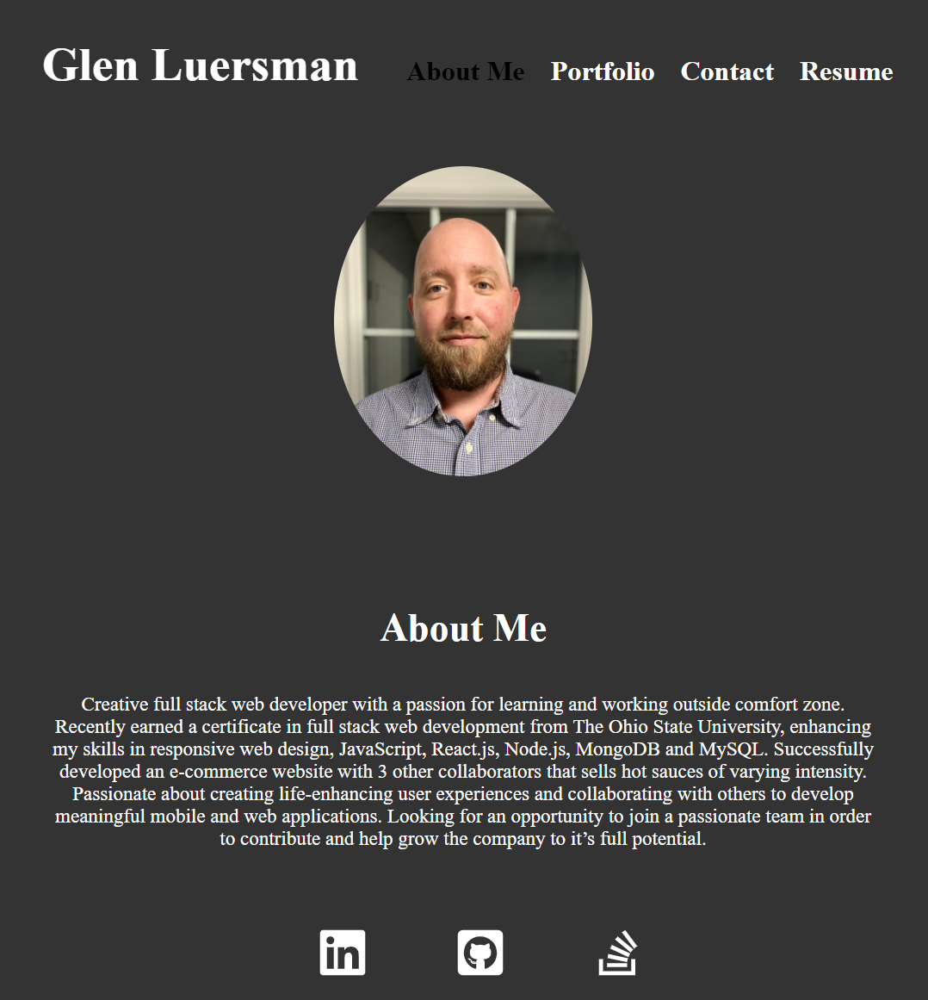
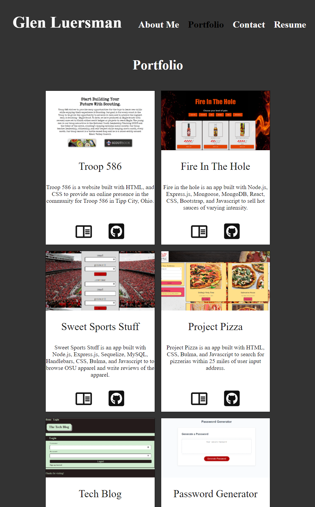
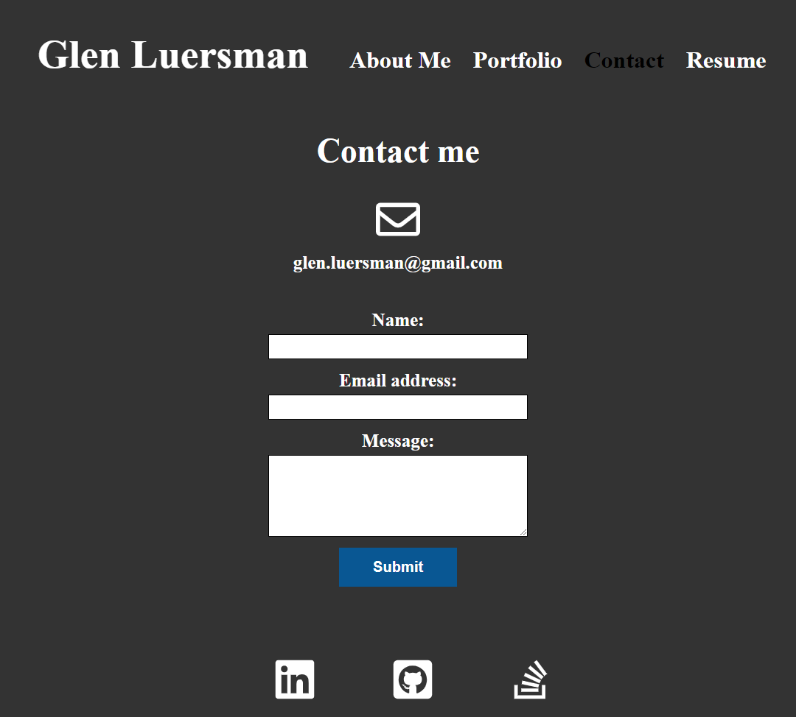
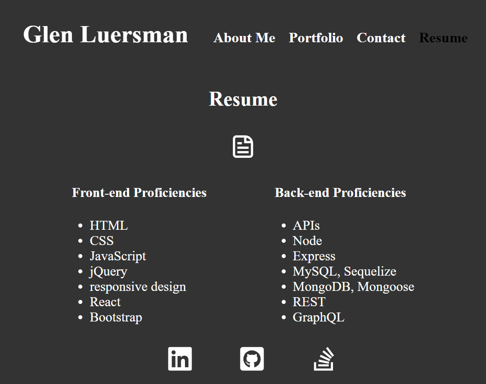

 </a>

<h3 align="center">React Portfolio</h3>

---

## 

- [About](#about)
- [Installing](#installing)
- [Usage](#usage)
- [Built With](#built_using)
- [Authors](#authors)
- [Questions](#questions)
- [Screenshots](#screenshots)

## 

- React Portfolio is my portfolio created using react

## 

- Navigate to `https://glenluersman.github.io/react-portfolio/` and you are presented with a my picture and a short bio about me. Notice that the `About Me` navigation title is highlighted. Clicking on the `Portfolio` navigation title will take you to six of my projects complete with titles, images, and icons that link to the deployed applications and the corresponding GitHub repositories. Notice how the `Portfolio` title is now highlighted. Next if you click on the `Contact` navigation title you will see a form you can use to contact me. Again notice how the `Contact` title is now highlighted.
Last if you click on the `Resume` navigation title you will see my resume with a toolbar where you can download my resume. And I'm sure by now you have noticed that the `Resume` title is now highlighted.

## 

- Node.js
- React
- Jsx
- CSS
- HTML

## 

- [glenluersman](https://github.com/glenluersman)

## 

- Feel free to open an issue or contact me directly at glen.luersman@gmail.com if you have any questions about the repo. You can find more of my work at [glenluersman](https://github.com/glenluersman/).

## 

Deployed URL: https://glenluersman.github.io/react-portfolio/

</a>

</a>

</a>

</a>
